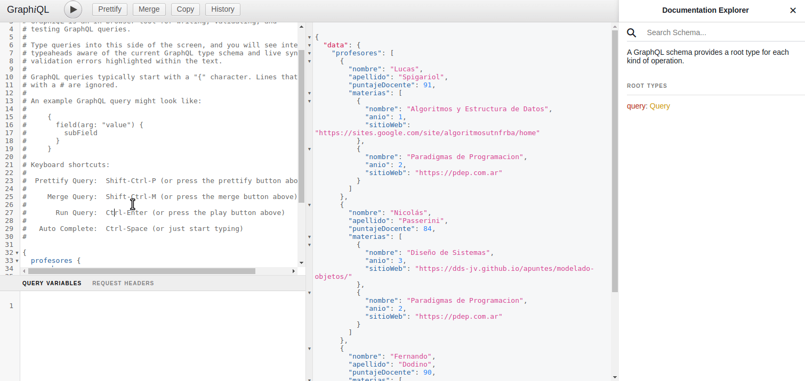

# Ejemplo Profesores y Materias GraphQL

[](https://github.com/uqbar-project/eg-profesores-graphql-kotlin/actions/workflows/build.yml)
[](https://codecov.io/gh/uqbar-project/eg-profesores-graphql-kotlin)

## GraphQL

En la [variante REST](https://github.com/uqbar-project/eg-profesores-springboot-kotlin) hemos implementado varios endpoints para una aplicación que relaciona materias y sus correspondientes profesores (una relación many-to-many). En esta versión estaremos resolviendo requerimientos similares utilizando la especificación **GraphQL**.

## Para más información

Pueden ver [esta presentación](https://docs.google.com/presentation/d/187zouUsasCy-SYEQybZBYONOh5BDKrLHdQib3--zn9E/edit#slide=id.p).

## GraphiQL para testeo local

- Levantamos la aplicación y luego en un navegador consultamos

```bash
http://localhost:8080/graphiql
```

Podemos ejecutar consultas custom:

```graphql
{
  profesores {
    nombre
    apellido
    puntajeDocente
    materias {
      nombre
      anio
    }
  }
}
```

E incluso podemos agregar `sitioWeb` a nuestro query, y navegar la estructura del profesor:



### Scalar

Si nos fijamos en la definición del objeto de dominio Materia

```kt
@Entity
class Materia(
   @Column var nombre: String = "",
   @Column var anio: Int,
   @Column var codigo: String,
   @Column var sitioWeb: URL,
   @Column var cargaHoraSemanal: Int
) {
   @Id
   @GeneratedValue(strategy = GenerationType.AUTO)
   var id: Long = 0
}
```

la URL es de tipo `java.net.URL`. ¿Cómo es que se convierte eso en un string adecuado?

Definimos URL como un **scalar**. GraphQL necesita replicar el modelo en su propio esquema, que podés ver en el archivo [schema.graphqls](./src/main/resources/schema/schema.graphqls)

```graphql
scalar URL

...

type Materia {
    nombre: String
    anio: Int
    codigo: String
    sitioWeb: URL
    cargaHoraSemanal: Int
}
```

GraphQL provee los tipos de dato estándar: String, Int (no LocalDate por ejemplo). Para la URL es necesario primero definirlo como un tipo de dato **scalar**. Eso requiere que implementemos una clase asociada a este scalar para hacer las conversiones desde y hacia los endpoints:

```kt
@DgsScalar(name = "URL")
class URLScalar : Coercing<URL, String> {
   // Convierto de URL a String para serializar la información cuando se devuelve un query
   override fun serialize(dataFetcherResult: Any): String {
      return (dataFetcherResult as? URL)?.toString()
         ?: throw CoercingSerializeException("El objeto no es de tipo URL: ${dataFetcherResult.javaClass.name}")
   }

   // Convierto de String a URL para deserializar la información en las mutaciones o queries que aceptan parámetros
   override fun parseValue(input: Any): URL {
      return try {
         if (input is String) {
            URL(input)
         } else {
            throw CoercingParseValueException("[GraphQL - URL] - El valor no es un string: [${input}]")
         }
      } catch (e: MalformedURLException) {
         throw CoercingParseValueException(
            "[GraphQL - URL] - URL inválida: [${input}]", e
         )
      }
   }

   override fun parseLiteral(input: Any): URL {
      return if (input is StringValue) {
         try {
            URL(input.value)
         } catch (e: MalformedURLException) {
            throw CoercingParseLiteralException(e)
         }
      } else {
         throw CoercingParseLiteralException("[GraphQL - URL] - El valor no es un string: [${input}]")
      }
   }
}
```

### Query

Por otra parte, podemos ver que ese archivo define un tipo Query para poder hacer consultas:

```graphql
...

type Query {
    profesores(nombreFilter: String): [Profesor]
}

type Profesor {
    nombre: String
    apellido: String
    anioComienzo: Int
    puntajeDocente: Int
    materias: [Materia]
}

type Materia { ... }
```

Eso hace que graphiql permita navegar el esquema en la parte derecha del navegador. El query se implementa delegando al repository, y reemplaza en esta arquitectura al par controller/service:

```kt
@DgsComponent
class ProfesoresDataFetcher {

   @Autowired
   lateinit var profesorRepository: ProfesorRepository

   @DgsQuery
   fun profesores(@InputArgument nombreFilter : String?) =
      profesorRepository.findAllByNombreCompleto((nombreFilter ?: "") + "%")

}
```

### Filtrando por nombre

El parámetro que define el schema:

```graphql
type Query {
    profesores(nombreFilter: String): [Profesor]
}
```

es recibido por el fetcher que a su vez delega la consulta al repository:

```kotlin
@DgsQuery
fun profesores(@InputArgument nombreFilter : String?) =
  profesorRepository.findAllByNombreCompleto((nombreFilter ?: "") + "%")
```

Eso nos permite consultar pasando como valor el nombre o apellido de una persona docente:

```graphql
{
    profesores(nombreFilter: "Lu") {
        nombre
        apellido
        puntajeDocente
        materias {
            nombre
            anio
        }
    }
}
```

## Mutation

La mutación requiere agregar información de tipos específicos o `input` en nuestro esquema:

```graphql
type Mutation {
    agregarMateria(idProfesor: Int, materiaInput: MateriaInput): Profesor
}

input MateriaInput {
    id: Int
    nombre: String
}
```

El mapeo de los parámetros se da utilizando como convención el mismo nombre en la implementación (en caso contrario debés usar anotaciones):

```kotlin
@DgsComponent
class ProfesoresMutation {

   @Autowired
   lateinit var profesorService: ProfesorService

   @DgsMutation
   fun agregarMateria(idProfesor: Int, materiaInput: MateriaInput) =
      profesorService.agregarMateria(idProfesor.toLong(), materiaInput.toMateria())

}

data class MateriaInput(val id: Int, val nombre: String) {
   fun toMateria(): Materia {
      val materia = Materia(nombre = nombre, sitioWeb = null)
      materia.id = id.toLong()
      return materia
   }
}
```

El service debe buscar profesor y materia (por nombre o id), agregar la materia al profesor y guardar la información (pueden ver la implementación dentro del repositorio).

Como resultado:

- es bastante burocrático agregar una mutación porque requiere definir un tipo específico para los parámetros (input vs. type)
- a su vez requiere formas de convertir nuestro input en objetos del negocio
- mientras que la convención REST no ayuda a entender de qué manera actualizar información de una entidad, GraphQL tiene una interfaz mucho más clara e intuitiva

Ejemplo de una mutación en GraphiQL:

```graphql
mutation {
  agregarMateria(
    idProfesor: 1, materiaInput: { id: 0, nombre: "Sistemas Operativos"}
  ) {
    id
    nombre
    apellido
    materias {
      nombre
    }
  }
}
```

O bien

```graphql
mutation {
  agregarMateria(
    idProfesor: 1, materiaInput: { id: 4, nombre: ""}
  ) {
    id
    nombre
    apellido
    materias {
      nombre
    }
  }
}
```

## Testing

El testeo de integración se hace a partir de dos variables que se inyectan en el test:

```kotlin
@SpringBootTest
@ActiveProfiles("test")
class ProfesorGraphQLTest {
   ...
   
   @Autowired
   lateinit var dgsQueryExecutor: DgsQueryExecutor

   @Autowired
   lateinit var profesoresMutation: ProfesoresMutation
```

Luego, tiene sentido hacer una búsqueda sencilla de los casos felices para una consulta:

```kotlin
    @Test
    fun `consulta de un profesor trae los datos correctamente`() {
        // Arrange
        val profesorId = crearProfesorConMaterias()
        val profesorPrueba = getProfesor(profesorId)

        // Act
        val profesorResult = buscarProfesor(profesorId)

        // Assert
        Assertions.assertThat(profesorResult.nombre).isEqualTo(profesorPrueba.nombre)
        Assertions.assertThat(profesorResult.materias.first().sitioWeb.toString()).contains(profesorPrueba.materias.first().sitioWeb.toString())
    }

    private fun buscarProfesores(nombreABuscar: String) = dgsQueryExecutor.executeAndExtractJsonPathAsObject("""
        {
            profesores(nombreFilter: "$nombreABuscar") {
                nombre
                apellido
                materias {
                    nombre
                    codigo
                }
            }
        }
    """.trimIndent(), "data.profesores[*]", object : TypeRef<List<Profesor>>() {}
    )
```

Debemos tener cuidado con que los constructores de los objetos de dominio admitan valores nulos o bien tengan un valor por defecto o estos tests pueden romperse si la consulta GraphQL no trae campos que sean necesarios para instanciar las entidades (por ejemplo si la Materia tiene un código que es un String y no tiene valor por defecto, si no agregamos el código en la consulta la deserialización se va a romper).

El lector puede ver el test de las mutaciones, que es similar a la variante REST solo que invocando a la mutación.
