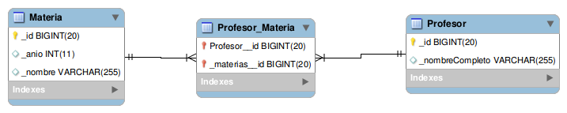

# Ejemplo Profesores y Materias GraphQL

Basado en [este ejemplo de DGS](https://netflix.github.io/dgs/getting-started/), un framework propio de Netflix.

[](https://github.com/uqbar-project/eg-profesores-springboot-kotlin/actions/workflows/build.yml) [](https://codecov.io/gh/uqbar-project/eg-profesores-springboot-kotlin)

## Prerrequisitos

- Necesitás instalar un motor de base de datos relacional (te recomendamos [MySQL](https://www.mysql.com/) que es OpenSource y gratuito)
- Revisá la password para conectarte a la base en el archivo [`application.yml`](./src/main/resources/application.yml):

```yml
    datasource:
      url: jdbc:mysql://localhost/facultad?createDatabaseIfNotExist=true
      username: root
      password:   # acá podés dejarla en blanco si no tenés contraseña o escribir la tuya
```

## Objetivo

Un profesor dicta una o varias materias, y a su vez cada materia es dictada por varies profesores. La solución muestra cómo se traduce esta relación en

- el modelo de objetos, donde simplemente tenemos una colección de materias en profesor (y podríamos tener eventualmente una colección de profesores en materia)
- el modelo relacional, que requiere una entidad que relacione profesor y materia mediante claves foráneas que referencien a sus identificadores. Esto no necesita de una entidad extra en el modelo de objetos porque de esa relación no nacen atributos (aunque podrían, si quisiéramos guardar por ejemplo la fecha en la que el profesor comenzó a dar la materia)

## Swagger / Open-API

El proyecto viene con las dependencias de Swagger2 por lo tanto podés testearlo directamente en el navegador cuando levantes la aplicación en la siguiente URL:

```url
http://localhost:8080/swagger-ui/index.html#
```

## Endpoints comunes

- `GET ./profesores/`: devuelve la lista de profesores, sin las materias
- `GET ./profesores/{id}`: devuelve los datos de un profesor con sus materias
- `GET ./materias/`: devuelve la lista de materias
- `PUT ./profesores/{id}`: actualiza un profesor con los datos del body

Se puede importar el archivo [Insomnia_Profesores.json](Insomnia_Profesores.json) en Insomnia, para tenerlos a mano.

## Endpoint especial

- `GET ./materias/{id}`: devuelve una materia, con sus profesores. 

Una decisión de diseño importante que tomamos fue **no tener referencias bidireccionales** (de profesor a materias y de materia a profesores). El primer motivo es didático, el segundo es que mantener esa relación bidireccional tiene un costo y debemos decidir quién es el dueño de esa relación (para no entrar en loop al agregar un profesor a una materia, además del agregado en cada una de las colecciones). Pueden consultar [este post de Stack overflow](https://stackoverflow.com/questions/22461613/pros-and-cons-of-jpa-bidirectional-relationships) para más información.


Como consecuencia de nuestra decisión de diseño, la materia no tiene la lista de profesores, pero nosotros queremos que este endpoint:

```bash
http://localhost:8080/materias/2
```

nos devuelva

```json
{
    "id": 2,
    "nombre": "Paradigmas de Programacion",
    "anio": 2,
    "profesores": [
        {
            "id": 4,
            "nombre": "Lucas Spigariol"
        },
        {
            "id": 5,
            "nombre": "Nicolás Passerini"
        }
    ]
}
```

Para ello vamos a necesitar dos pasos:

1. Aprovechar que el modelo relacional nos permite hacer un JOIN partiendo de cualquiera de las entidades (tiene una navegación más flexible que el modelo de grafo de objetos). Haremos un query en [JPQL](https://es.wikipedia.org/wiki/Java_Persistence_Query_Language) (Java Persistence Query Language), una variante de SQL que trata de acercarse más al paradigma de objetos.

```kotlin
@Query("""
        SELECT m.id as id,
               m.nombre as nombre, 
               m.anio as anio,
               p.id as profesorId,
               p.nombreCompleto as profesorNombre 
          FROM Profesor p 
               INNER JOIN p.materias m
         WHERE m.id = :id
        """)
fun findFullById(id: Long): List<MateriaFullRowDTO>
```

El resultado de esa consulta son n registros, porque es el producto cartesiano de 1 materia con n profesores.

El DTO es una interfaz, donde por convención los atributos se corresponden con el alias que le pusimos en el query:

```kotlin
data class MateriaDTO(val id: Long, 
                      val nombre: String, 
                      val anio: Int, 
                      val profesores: List<ProfesorDTO>)
```

Podemos mapear el atributo de nuestro DTO con otro nombre, mediante la anotación `@Value`:

```kotlin
interface MateriaFullRowDTO {
    fun getId(): Long
    @Value("#{target.nombre}") // el formato es "target".{atributo del query}
    fun getNombreLindo(): String
    ...
}
```

En este caso el campo `nombre` se asocia al valor que vamos a llamar `nombreLindo` en nuestro DTO.

2. Como queremos que el endpoint devuelva una sola entidad materia, vamos a agrupar todos los profesores en una lista, y tomaremos la información de la materia una sola vez (porque sabemos que las otras filas simplemente repiten el dato):

```kotlin
@Transactional(readOnly = true)
fun getMateria(id: Long): MateriaDTO {
    // Recibimos n registros de materias
    val materiasDTO = materiaRepository.findFullById(id)
    if (materiasDTO.isEmpty()) {
        throw NotFoundException("La materia con identificador $id no existe")
    }

    // Agrupamos los profesores de la materia
    val materia = materiasDTO.first()
    val profesores = materiasDTO.map { ProfesorDTO(it.getProfesorId(), it.getProfesorNombre()) }
    return MateriaDTO(materia.getId(), materia.getNombreLindo(), materia.getAnio(), profesores)
}
```

## Testing

Como cuenta [este artículo](https://www.testim.io/blog/unit-test-vs-integration-test/), tenemos que tomar una decisión de diseño sobre cómo testear este componente que creamos. Sabemos que

- los tests unitarios prueban una unidad funcional, no trabajan con la base de datos ni con la red, como consecuencia **son más rápidos de ejecutar y más fáciles para generar y mantener**. Como contrapartida, necesitan mecanismos para simular efectos, operaciones costosas o donde interviene el azar, y es importante entender que eso reduce la eficacia para encontrar problemas.
- por otra parte, los tests de integración requieren un mayor esfuerzo de desarrollo, porque están probando la integración de varios componentes de nuestra arquitectura.

En este caso nos vamos a concentrar más en los segundos tipos de tests, principalmente porque el dominio tiene pocas reglas de negocio (decisión didáctica que nos permite concentrarnos más en la persistencia), y porque Springboot también nos ayuda a tener una solución declarativa: casi no hay líneas en la definición del repositorio. En una aplicación comercial, los tests unitarios nos ayudan a iniciar el desarrollo (sobre todo si aplicamos TDD) y **complementan** a los tests de integración, que por su costo suelen ser más escasos y se concentran en los caminos frecuentes que realiza el usuario. No es una decisión excluyente, necesitamos ambos tipos de tests en nuestra arquitectura.

### Implementación del primer test de integración

Veamos entonces cómo Springboot nos ayuda a construir un entorno de testing que comienza en el endpoint (el Controller), pasa al repositorio y se apoya en los objetos de dominio:

```kotlin
@Test
fun `al consultar todos los profesores no sabemos las materias en las que participa`() {
    val responseEntity = mockMvc
        .perform(MockMvcRequestBuilders.get("/profesores"))
        .andReturn().response
    val profesores = mapper.readValue<List<Profesor>>(responseEntity.contentAsString)
    assertEquals(200, responseEntity.status)
    assertTrue(profesores.isNotEmpty())
    // los profesores no traen las materias
    assertEquals(0, profesores.first().materias.size)
}
```

El mismo mecanismo de bootstrap que crea los profesores para levantar la aplicación es el que estamos utilizando en los tests, solo que en lugar de trabajar con una base de datos real estaremos usando una base relacional en memoria, H2. Esto se configura en la clase de test:

```kotlin
@SpringBootTest
@AutoConfigureMockMvc
@ActiveProfiles("test")
@DisplayName("Dado un controller de profesores")
class ProfesorControllerTest {
```

La anotación ActiveProfiles que contiene el valor `test` por convención nos permite definir en un archivo `application-test.yml` la conexión a la base en memoria:

```yml
spring:
  h2:
    console:
      enabled: true
      path: /h2

  datasource:
    url: jdbc:h2:mem:test
    username: sa
    password: sa
    driver-class-name: org.h2.Driver
```

En general el nombre es `application-XXX.yml` donde XXX será el valor que le pasaremos a la anotación ActiveProfiles.

### Tipos de tests de Springboot

La segunda anotación que queremos comentar es `@SpringBootTest` que es el que nos permite ejecutar tests de integración. Otras variantes son

- `@DataJpaTest`: útil si queremos hacer el test de integración únicamente contra el repositorio (en el ejemplo nosotros queremos testear la integración del controller con el repositorio). Esto automáticamente configura la base H2 en memoria, sin necesidad de que lo hagamos nosotros manualmente.
- `@WebMvcTest`: sirven para hacer test de integración de los endpoints, porque levantan un entorno de prueba más rápido que el web server. El tema es que si queremos trabajar con repositorios, debemos usar la anotación `@MockBean` que nos permite generar un _mock_ del mismo. Entonces la prueba que estamos haciendo no es completa.
- `@SpringBootTest`: es el que nos permite generar un entorno de prueba completo, donde no se mockee repositorios ni ningún otro componente, y por lo tanto es el que utilizamos en este caso.

Para más información recomendamos leer [el artículo de Springboot de Baeldung](https://www.baeldung.com/spring-boot-testing)

### Prueba de integración a nivel repositorio

Para mostrar un ejemplo de tests de integración a nivel repositorio con la anotación `@DataJpaTest`, vamos a implementar tests contra el query que trae una materia con la lista de profesores, que requiere un _query custom_, ya que testear los queries que genera Springboot automáticamente no tiene mucho sentido.

Tomemos entonces el caso de una materia que tiene dos profesores, debería devolver 2 filas, que representa el producto cartesiano MxP (Materia x Profesor):

```kotlin
@Test
fun `al pedir la información de una materia que tiene varios profesores trae una fila por cada profesor (producto cartesiano)`() {
   // Arrange
   val materia = materiaRepository.save(Materia(nombre = "Algoritmos II", anio = 1))
   val profe1 = profesorRepository.save(Profesor(nombreCompleto = "Fernando Dodino").apply {
      materias = mutableSetOf(materia)
   })
   val profe2 = profesorRepository.save(Profesor(nombreCompleto = "Julián Mosquera").apply {
      materias = mutableSetOf(materia)
   })

   val materias = materiaRepository.findFullById(materia.id)

   // Assert
   assertEquals(2, materias.size)
}
```

Podríamos hacer un test más exhaustivo, como que la información sobre los profesores o las materias coincida, dejamos al lector la decisión sobre cómo implementar dichos tests.

Algo interesante que ocurre con los `@DataJpaTest` es que

- no producen efectos colaterales, esto significa que al final de cada método los cambios se deshacen
- esto permite que el siguiente test tenga su propio juego de datos, sin tener dependencia en el orden en que corren los tests, como en el caso de los tests unitarios
- como la base de datos está embebida en memoria, la ejecución de los tests es rápida

Como contrapartida, al utilizar una base en memoria en lugar de una base real, hay limitaciones en cuanto a su alcance y efectividad para detectar problemas antes de la salida a producción.

### Test de Controllers

La anotación `@WebMvcTest` permite hacer testeos a nivel http sobre los controllers, utilizando también el objeto mockMvc. Los tests tienen un alcance limitado y necesitan mockear o definir los beans que queremos inyectar como dependencias, por eso no son tan adecuados para esta materia como los `@SpringBootTest` que veremos a continuación.

Dejamos un ejemplo ilustrativo, donde utilizando `@MockBean` y Mockito mostramos un ejemplo de cómo funciona el controller cuando el service no encuentra una materia en el método GET que devuelve los datos de una materia:

```kotlin
@Test
fun `al pedir la informacion completa de una materia que no existe tiene que devolver un 404`() {
  Mockito.`when`(materiaService.getMateria(1)).thenAnswer { throw NotFoundException("Materia no existe") }
  mockMvc.perform(MockMvcRequestBuilders.get("/materias/1"))
     .andExpect(MockMvcResultMatchers.status().isNotFound)
}
```

### Ver datos de un profesor

En este test queremos traer el dato de un profesor. Para garantizar que el test no dependa de ningún dato creado anteriormente, en la fase `Arrange` vamos a crear un ejemplo para usarlo luego:

```kotlin
@Test
fun `al traer el dato de un profesor trae las materias en las que participa`() {
    val profesorId = crearProfesorConMaterias()

    val profesorPrueba = getProfesor(profesorId)

    val responseEntity = mockMvc.perform(MockMvcRequestBuilders.get("/profesores/${profesorPrueba.id}")).andReturn().response
    assertEquals(200, responseEntity.status)
    val profesor = mapper.readValue<Profesor>(responseEntity.contentAsString)
    assertEquals(profesorPrueba.materias.size, profesor.materias.size)
}
```

Una configuración que permite que los profesores tengan su propio ID autoincremental es mediante la siguiente anotación:

```kotlin
@Id
// El GenerationType asociado a la TABLE es importante para tener
// una secuencia de identificadores única para los profesores
// (para que no dependa de otras entidades anteriormente creadas)
@GeneratedValue(strategy = GenerationType.TABLE)
var id: Long = 0
```

Es importante tener el control del identificador que se genera porque es nuestro punto de entrada para hacer el pedido get al controller. Luego validamos que

- nos devuelva un código http 200
- y que además la información del profesor contenga las materias que da ese docente

### Test de actualización

Por último, tenemos un test de integración que va a producir un efecto colateral. En este caso vamos a

- tomar la información de un profesor
- producir un efecto (dictará una materia nueva) y persistir ese efecto haciendo una llamada http PUT
- hacer la llamada GET verificando que el efecto se persitió (comparando con el valor que tenía antes del cambio)
- y por último, se deshace el cambio mediante la anotación `@Transactional` sobre el test

```kotlin
@Test
@Transactional
fun `podemos actualizar la informacion de un profesor`() {
   // Arrange
   val profesorId = crearProfesorConMaterias()
   val profesorOriginal = getProfesor(profesorId)
   val materiaNueva = repoMaterias.save(Materia().apply {
      nombre = "Ingeniería de Software"
   })
   val cantidadMateriasOriginales = profesorOriginal.materias.size
   assertEquals(1, cantidadMateriasOriginales)

   // Act
   profesorOriginal.agregarMateria(materiaNueva)
   updateProfesor(profesorOriginal)

   // Assert
   val nuevoProfesor = getProfesor(profesorOriginal.id)
   val materiasDelProfesorAhora = nuevoProfesor.materias.size
   assertEquals(materiasDelProfesorAhora, cantidadMateriasOriginales + 1)
}
```

### Variante con asserts más declarativos

Vemos a continuación un ejemplo de cómo testeamos el controller de materias, en forma más declarativa:

```kt
@Test
fun `al buscar la informacion de una materia correcta recibimos la agrupacion de profesores que la dan`() {
    val materia = repoMaterias.findAll().first()
    mockMvc.perform(MockMvcRequestBuilders.get("/materias/${materia.id}"))
        .andExpect(MockMvcResultMatchers.status().isOk)
        .andExpect(MockMvcResultMatchers.jsonPath("$.nombre").value(materia.nombre))
        .andExpect(MockMvcResultMatchers.jsonPath("$.anio").value(materia.anio))
        .andExpect(MockMvcResultMatchers.jsonPath("$.profesores").isArray)
}
```

- en lugar de utilizar un mapper y chequear contra un objeto, utilizamos matchers de JSON, donde `$.profesores` hace referencia al elemento profesores del JSON que se devuelve
- tampoco chequeamos el tamaño exacto de la colección, de esa manera **nuestros tests se vuelven más resilientes ante cambios en los datos de prueba** (solo verificamos que la lista de profesores devuelta sea un array)
- y también utilizamos cualquier materia en lugar de trabajar con un ID específico, eso también ayuda al mantenimiento posterior. A cambio debemos tener cuidado con la instrucción `repoMaterias.findAll().first()` si nuestro bootstrap va a instanciar una gran cantidad de datos (algo improbable pero que puede darse) 

## Material adicional

- [Testeo con @DataJPATest - recomendaciones](https://reflectoring.io/spring-boot-data-jpa-test/)
- [Artículo de Baeldung](https://www.baeldung.com/jpa-many-to-many), donde define una relación many-to-many en forma bidireccional
- [Artículo de Stack Overflow](https://stackoverflow.com/questions/42394095/many-to-many-relationship-between-two-entities-in-spring-boot)
- [Testeo unitario y testeo de integración](https://www.testim.io/blog/unit-test-vs-integration-test/)

## Diagrama entidad-relación


