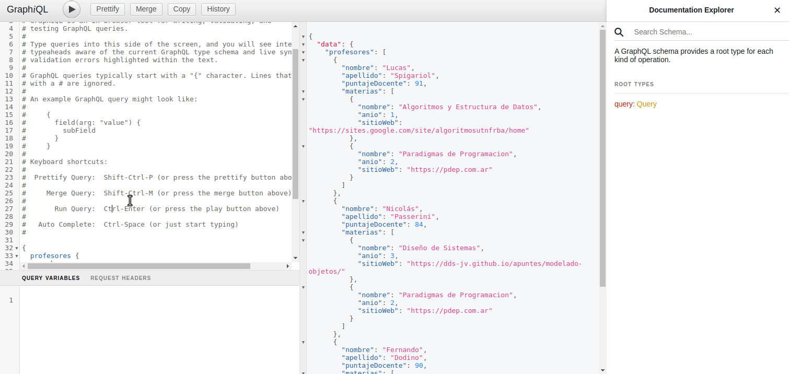
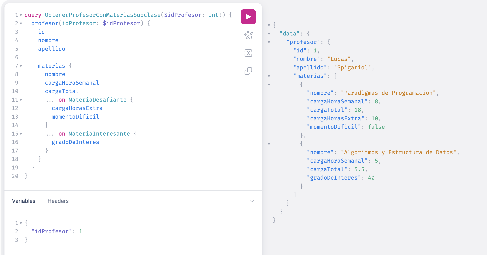
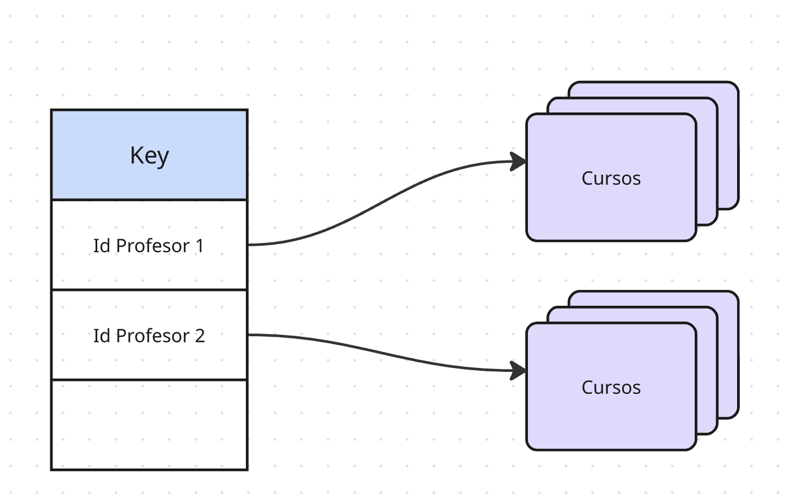

# Ejemplo Profesores y Materias GraphQL

[](https://github.com/uqbar-project/eg-profesores-graphql-kotlin/actions/workflows/build.yml)
[](https://codecov.io/gh/uqbar-project/eg-profesores-graphql-kotlin)

## GraphQL

En la [variante REST](https://github.com/uqbar-project/eg-profesores-springboot-kotlin) hemos implementado varios endpoints para una aplicación que relaciona materias y sus correspondientes profesores (una relación many-to-many). En esta versión estaremos resolviendo requerimientos similares utilizando la especificación **GraphQL**.

## Para más información

Pueden ver [esta presentación](https://docs.google.com/presentation/d/187zouUsasCy-SYEQybZBYONOh5BDKrLHdQib3--zn9E/edit#slide=id.p).

## GraphiQL para testeo local

- Levantamos la aplicación y luego en un navegador consultamos

```bash
http://localhost:8080/graphiql
```

Podemos ejecutar consultas custom:

```graphql
{
  profesores {
    nombre
    apellido
    puntajeDocente
    materias {
      nombre
      anio
    }
  }
}
```

E incluso podemos agregar `sitioWeb` a nuestro query, y navegar la estructura del profesor:



### Scalar

Si nos fijamos en la definición del objeto de dominio Materia

```kt
@Entity
class Materia(
   @Column var nombre: String = "",
   @Column var anio: Int,
   @Column var codigo: String,
   @Column var sitioWeb: URL,
   @Column var cargaHoraSemanal: Int
) {
   @Id
   @GeneratedValue(strategy = GenerationType.AUTO)
   var id: Long = 0
}
```

la URL es de tipo `java.net.URL`. ¿Cómo es que se convierte eso en un string adecuado?

Definimos URL como un **scalar**. GraphQL necesita replicar el modelo en su propio esquema, que podés ver en el archivo [schema.graphqls](./src/main/resources/schema/schema.graphqls)

```graphql
scalar URL

...

type Materia {
    nombre: String
    anio: Int
    codigo: String
    sitioWeb: URL
    cargaHoraSemanal: Int
}
```

GraphQL provee los tipos de dato estándar: String, Int (no LocalDate por ejemplo). Para la URL es necesario primero definirlo como un tipo de dato **scalar**. Eso requiere que implementemos una clase asociada a este scalar para hacer las conversiones desde y hacia los endpoints:

```kt
@DgsScalar(name = "URL")
class URLScalar : Coercing<URL, String> {
   // Convierto de URL a String para serializar la información cuando se devuelve un query
   override fun serialize(dataFetcherResult: Any): String {
      return (dataFetcherResult as? URL)?.toString()
         ?: throw CoercingSerializeException("El objeto no es de tipo URL: ${dataFetcherResult.javaClass.name}")
   }

   // Convierto de String a URL para deserializar la información en las mutaciones o queries que aceptan parámetros
   override fun parseValue(input: Any): URL {
      return try {
         if (input is String) {
            URL(input)
         } else {
            throw CoercingParseValueException("[GraphQL - URL] - El valor no es un string: [${input}]")
         }
      } catch (e: MalformedURLException) {
         throw CoercingParseValueException(
            "[GraphQL - URL] - URL inválida: [${input}]", e
         )
      }
   }

   override fun parseLiteral(input: Any): URL {
      return if (input is StringValue) {
         try {
            URL(input.value)
         } catch (e: MalformedURLException) {
            throw CoercingParseLiteralException(e)
         }
      } else {
         throw CoercingParseLiteralException("[GraphQL - URL] - El valor no es un string: [${input}]")
      }
   }
}
```

### Query

Por otra parte, podemos ver que ese archivo define un tipo Query para poder hacer consultas:

```graphql
...

type Query {
    profesores(nombreFilter: String): [Profesor]
}

type Profesor {
    nombre: String
    apellido: String
    anioComienzo: Int
    puntajeDocente: Int
    materias: [Materia]
}

type Materia { ... }
```

Eso hace que graphiql permita navegar el esquema en la parte derecha del navegador. El query se implementa delegando al repository, y reemplaza en esta arquitectura al par controller/service:

```kt
@DgsComponent
class ProfesoresDataFetcher {

   @Autowired
   lateinit var profesorRepository: ProfesorRepository

   @DgsQuery
   fun profesores(@InputArgument nombreFilter : String?) =
      profesorRepository.findAllByNombreCompleto((nombreFilter ?: "") + "%")

}
```

### Filtrando por nombre

El parámetro que define el schema:

```graphql
type Query {
    profesores(nombreFilter: String): [Profesor]
}
```

es recibido por el fetcher que a su vez delega la consulta al repository:

```kotlin
@DgsQuery
fun profesores(@InputArgument nombreFilter : String?) =
  profesorRepository.findAllByNombreCompleto((nombreFilter ?: "") + "%")
```

Eso nos permite consultar pasando como valor el nombre o apellido de una persona docente:

```graphql
{
    profesores(nombreFilter: "Lu") {
        nombre
        apellido
        puntajeDocente
        materias {
            nombre
            anio
        }
    }
}
```

## Mapeo de herencia: trayendo información específica

Como en realidad tenemos subclases de materia, cómo podemos traer información de cada una? Utilizamos una interface en nuestro esquema GraphQL:

```graphql
interface Materia {
    nombre: String!
    anio: Int
    codigo: String
    sitioWeb: URL
    cargaHoraSemanal: Int
    # campo calculado (en común)
    cargaTotal: Float
}

# 1. Subclase: MateriaInteresante
type MateriaInteresante implements Materia {
    nombre: String!
    anio: Int
    codigo: String
    sitioWeb: URL
    cargaHoraSemanal: Int
    cargaTotal: Float

    # Campo específico
    gradoDeInteres: Int
}

# 2. Subclase: MateriaDesafiante
type MateriaDesafiante implements Materia {
    nombre: String!
    anio: Int
    codigo: String
    sitioWeb: URL
    cargaHoraSemanal: Int
    cargaTotal: Float

    # Campos específicos
    cargaHorasExtra: Int
    momentoDificil: Boolean
}
```

Veamos esta query ad-hoc:

```graphql
# Consulta para obtener un profesor y su lista de materias.
query ObtenerProfesorConMateriasSubclase($idProfesor: Int!) {
  profesor(idProfesor: $idProfesor) {
    id
    nombre
    apellido
    
    materias {
      # 1. Campos comunes (de la interfaz Materia)
      nombre
      cargaHoraSemanal
      cargaTotal
        
      # 2. Uso de Fragmentos para campos específicos:
      # Fragmento Inline para MateriaDesafiante
      # Este bloque SOLO se ejecuta si el objeto 'materia' es de tipo MateriaDesafiante
      ... on MateriaDesafiante {
        # Campos que solo existen en la subclase MateriaDesafiante
        cargaHorasExtra
        momentoDificil
      }
      
      # Fragmento Inline para MateriaInteresante
      # Este bloque SOLO se ejecuta si el objeto 'materia' es de tipo MateriaInteresante
        ... on MateriaInteresante {
        gradoDeInteres
      }
    }
  }
}
```

Fíjense que podemos definir una variable con su respectivo valor en la solapa de abajo. Luego ejecutamos la query y obtenemos los resultados esperados:



Cada subclase particular activa el bloque `... on SubclaseDeMateria`, que representa un [fragment](https://graphql.org/learn/queries/#fragments), una estructura de campos reutilizable en más de un contexto. 

En general, los fragmentos son útiles cuando necesitamos reutilizarlos en consultas. Podés encontrar más información en la [página oficial de GraphQL](https://graphql.org/learn/queries/#fragments).

## Propiedad calculada cargaTotal

Otro detalle interesante es que definimos una interface Materia que tiene una propiedad cargaTotal, que **no se implementa con un atributo sino con un _template method_**. Basta igualmente con implementarlo en cada subclase

```kt
abstract class Materia() {
  ... 
  open fun cargaTotal() = cargaHoraSemanal + cargaHorasExtra()
  abstract fun cargaHorasExtra(): Double
}

class MateriaInteresante() : Materia() {
   @Column var gradoDeInteres: Int = 0
   override fun cargaHorasExtra() = cargaHoraSemanal * if (gradoDeInteres > 50) 0.2 else 0.1
}

class MateriaDesafiante() : Materia() {
   @Column var cargaHorasExtra: Double = 0.0
   @Column var momentoDificil: Boolean = false
   override fun cargaHorasExtra() = if (momentoDificil) cargaHorasExtra else 10.0
}
```

y podemos obtener el valor en nuestras consultas GraphQL:

```graphql
query datosDeProfesor($idProfesor: Int!) {
  profesor(idProfesor: $idProfesor) {
    nombre
    apellido    
    materias {
      nombre
      cargaTotal
    }
```

## Definiendo cursos: Data Fetcher

Un profesor es asignado ahora a varios cursos, la relación es _one to many_, porque cada curso es impartido por un solo profesor a la vez pero un profesor puede estar a cargo de varios cursos.

Qué pasa si queremos hacer la consulta:

```graphql
query datosDeProfesor($idProfesor: Int!) {
  profesor(idProfesor: $idProfesor) {
    nombre
    apellido    
    cursos {
      cantidadInscriptos
      turno
      materia {
        nombre
      }
    }
  }
}
```

El resultado es que falla:

```graphql
{
  "errors": [
    {
      "message": "INTERNAL",
      "extensions": {
        "errorType": "INTERNAL"
      }
    }
  ]
}
```

En la consola de IntelliJ vemos que el error es un viejo conocido:

```bash
org.hibernate.LazyInitializationException: failed to lazily initialize a collection of role: com.uqbar.profesores.domain.Profesor.cursos: could not initialize proxy - no Session
	at org.hibernate.collection.spi.AbstractPersistentCollection.throwLazyInitializationException(AbstractPersistentCollection.java:635) ~[hibernate-core-6.6.36.Final.jar:6.6.36.Final]
	at org.hibernate.collection.spi.AbstractPersistentCollection.withTemporarySessionIfNeeded(AbstractPersistentCollection.java:219) ~[hibernate-core-6.6.36.Final.jar:6.6.36.Final]
	at org.hibernate.collection.spi.AbstractPersistentCollection.readSize(AbstractPersistentCollection.java:150) ~[hibernate-core-6.6.36.Final.jar:6.6.36.Final]
	at org.hibernate.collection.spi.PersistentSet.size(PersistentSet.java:148) ~[hibernate-core-6.6.36.Final.jar:6.6.36.Final]
	at graphql.util.FpKit.toSize(FpKit.java:198) ~[graphql-java-22.3.jar:na]
	at graphql.execution.ExecutionStrategy.completeValueForList(ExecutionStrategy.java:784) ~[graphql-java-22.3.jar:na]
	at graphql.execution.ExecutionStrategy.completeValueForList(ExecutionStrategy.java:769) ~[graphql-java-22.3.jar:na]
	at graphql.execution.ExecutionStrategy.completeValue(ExecutionStrategy.java:686) ~[graphql-java-22.3.jar:na]
```

El repository no trae la lista de cursos de un profesor:

```kt
interface ProfesorRepository : CrudRepository<Profesor, Long> {
    @EntityGraph(attributePaths = ["materias"])
    override fun findById(id: Long): Optional<Profesor>
```

Podemos resolverlo incorporándolo al entity graph. El lector podría pensar: "pero entonces para cubrirme de todos los casos debería agregar la relación con todas las otras entidades". Y un poco es la debilidad del modelo de GraphQL, entonces vamos a trabajar con otro concepto que nos es útil

- si no podemos/queremos agregar en el Repository la relación con otras entidades
- y recordemos que el EntityGraph en el Repository evita el problema principal que queremos atacar: los **N + 1** queries (que si un profesor tiene 10 cursos, tengamos que hacer 11 queries, uno para traer el profesor y uno para cada Curso que tenga asignado)

### Definiendo un data loader

El Data Loader propone una estructura donde tengamos

- el id del profesor
- y la lista de cursos



Para eso crearemos un servicio que trae los cursos de una lista de profesores (pasándole los ids) y lo usaremos en el Data Loader.

```kt
@DgsDataLoader(name = "cursos")
class CursosDataLoader : BatchLoader<Long, List<Curso>> {
    @Autowired
    lateinit var cursoService: CursoService

    override fun load(idProfesores: MutableList<Long>): CompletionStage<List<List<Curso>>> {
        return CompletableFuture.supplyAsync {
            cursoService.getCursosPorProfesor(idProfesores)
        }
    }
}
```

Esta llamada la hacemos en forma **asincrónica** donde

- CompletionStage es el resultado de una llamada asincrónica no bloqueante (lo que en JS es una _Promise_)
- CompletableFuture permite construir esa llamada, devolviendo un CompletionStage (equivale a devolver el control inmediato y dejar procesando en background la promesa)

En la JDK tenemos dos conceptos para manejar asincronismo: el Future y el CompletionStage. El Future no permite componer operaciones: si yo quiero hacer algo posterior a la ejecución del callback asincrónico, necesito hacer `get()` que es una operación **bloqueante**, por lo que pierde el sentido del asincronismo.

El CompletableFuture por el contrario permite operar los resultados encadenando así las llamadas asincrónicas al igual que las promesas de Javascript. Para más información recomendamos leer [el artículo de Baeldung](https://www.baeldung.com/java-completablefuture), en especial el párrafo _6. Combining Futures_.

Lo interesante es que el CursoService permite devolver una matriz de cursos (sin que lo tengamos que definir como asincrónico):

```kotlin
    @Transactional(readOnly = true)
    fun getCursosPorProfesor(idProfesores: List<Long?>): List<List<Curso>> {
        val profesoresConCursos = profesorRepository.findAllById(idProfesores.filterNotNull())
        val cursosAgrupadosPorProfesorId: Map<Long, List<Curso>> = profesoresConCursos
            .associate { profesor ->
                profesor.id to profesor.cursos.toList()
            }
        return idProfesores.map { profesorId ->
            cursosAgrupadosPorProfesorId.getOrElse(profesorId!!) { emptyList() }
        }
    }
```

> Un dato importante es que tenemos que respetar el mismo tamaño de los ids que recibimos. Entonces si un profesor no tiene cursos, tenemos que devolver una lista vacía en ese elemento. Esto es porque se trabaja por posición y no con un mapa clave-valor que sería más lógico.

### Data Fetcher

El DataLoader tiene una anotación donde define el nombre "cursos", que vamos a utilizar a continuación en un nuevo fetcher:

```kt
@DgsComponent
class CursosDataFetcher {
    @DgsData(parentType = "Profesor", field = "cursos")
    fun cursos(dataFetchingEnvironment: DataFetchingEnvironment): CompletionStage<List<Curso>> {
        val profesor = dataFetchingEnvironment.getSource<Profesor>()
        val dataLoader: DataLoader<Long, List<Curso>> = dataFetchingEnvironment.getDataLoader("cursos")!!
        return dataLoader.load(profesor?.id)
    }
}
```

Aquí podemos ver que el fetcher asocia el nodo Profesor de graphql (primera línea) con el data loader que nos devuelve la lista de cursos (segunda línea), para finalmente hacer el filtrado de los cursos en base a la información del id de profesor (tercera línea).  

### Resultado final

De esa manera cuando el usuario pide los cursos de un profesor se activa el Data Loader. En este caso:

```graphql
query datosDeProfesor($idProfesor: Int!) {
    profesor(idProfesor: $idProfesor) {
        id
        nombre
        apellido
    }
}
```

solo se dispara un query:

```kotlin
Hibernate: 
    select
        p1_0.id,
        p1_0.anio_comienzo,
        p1_0.apellido,
        m1_0.profesor_id,
        m1_1.id,
        case 
            when m1_2.id is not null 
                then 1 
            when m1_3.id is not null 
                then 2 
        end,
        m1_1.anio,
        m1_1.carga_hora_semanal,
        m1_1.codigo,
        m1_1.nombre,
        m1_1.sitio_web,
        m1_2.carga_horas_extra,
        m1_2.momento_dificil,
        m1_3.grado_de_interes,
        p1_0.nombre,
        p1_0.puntaje_docente 
    from
        profesor p1_0 
    left join
        profesor_materias m1_0 
            on p1_0.id=m1_0.profesor_id 
    left join
        materia m1_1 
            on m1_1.id=m1_0.materias_id 
    left join
        materia_desafiante m1_2 
            on m1_1.id=m1_2.id 
    left join
        materia_interesante m1_3 
            on m1_1.id=m1_3.id 
    where
        p1_0.id=?
```

Mientras que esta consulta GraphQL

```graphql
query datosDeProfesores {
    profesores(nombreFilter: "") {
        id
        nombre
        apellido
        cursos {
            cantidadInscriptos
            turno
            materia {
                nombre
            }
        }
    }
}
```

se resuelve con dos consultas a la base:

- una para obtener los datos de un profesor
- y finalmente el que trae los datos de los cursos de todos los profesores cuyo id pasamos

```bash
Hibernate: 
    select
        p1_0.id,
        p1_0.anio_comienzo,
        p1_0.apellido,
        m1_0.profesor_id,
        m1_1.id,
        case 
            when m1_2.id is not null 
                then 1 
            when m1_3.id is not null 
                then 2 
        end,
        m1_1.anio,
        m1_1.carga_hora_semanal,
        m1_1.codigo,
        m1_1.nombre,
        m1_1.sitio_web,
        m1_2.carga_horas_extra,
        m1_2.momento_dificil,
        m1_3.grado_de_interes,
        p1_0.nombre,
        p1_0.puntaje_docente 
    from
        profesor p1_0 
    left join
        profesor_materias m1_0 
            on p1_0.id=m1_0.profesor_id 
    left join
        materia m1_1 
            on m1_1.id=m1_0.materias_id 
    left join
        materia_desafiante m1_2 
            on m1_1.id=m1_2.id 
    left join
        materia_interesante m1_3 
            on m1_1.id=m1_3.id 
    where
        p1_0.apellido like ? escape '' 
        or p1_0.nombre like ? escape ''
Hibernate: 
    select
        p1_0.id,
        p1_0.anio_comienzo,
        p1_0.apellido,
        c1_0.profesor_id,
        c1_1.id,
        c1_1.cantidad_inscriptos,
        m1_0.id,
        case 
            when m1_1.id is not null 
                then 1 
            when m1_2.id is not null 
                then 2 
        end,
        m1_0.anio,
        m1_0.carga_hora_semanal,
        m1_0.codigo,
        m1_0.nombre,
        m1_0.sitio_web,
        m1_1.carga_horas_extra,
        m1_1.momento_dificil,
        m1_2.grado_de_interes,
        c1_1.turno,
        p1_0.nombre,
        p1_0.puntaje_docente 
    from
        profesor p1_0 
    join
        profesor_cursos c1_0 
            on p1_0.id=c1_0.profesor_id 
    join
        curso c1_1 
            on c1_1.id=c1_0.cursos_id 
    join
        materia m1_0 
            on m1_0.id=c1_1.materia_id 
    left join
        materia_desafiante m1_1 
            on m1_0.id=m1_1.id 
    left join
        materia_interesante m1_2 
            on m1_0.id=m1_2.id 
    where
        p1_0.id in (?, ?, ?)
```

Para más información pueden ver [este artículo de DGS](https://netflix.github.io/dgs/data-loaders/).

## Enum types

Un detalle adicional es que el curso se asigna a un turno mañana, tarde o noche:

```kotlin
class Curso {
    ...
    @Column var turno: Turno = Turno.NOCHE
}

enum class Turno {
    MANIANA, TARDE, NOCHE
}
```

Y eso se refleja tal cual en nuestro schema:

```graphql
enum Turno {
    MANIANA
    TARDE
    NOCHE
}

type Curso {
    materia: Materia
    cantidadInscriptos: Int
    turno: Turno
}
```

## Mutation

La mutación requiere agregar información de tipos específicos o `input` en nuestro esquema:

```graphql
type Mutation {
    agregarMateria(idProfesor: Int, materiaInput: MateriaInput): Profesor
}

input MateriaInput {
    id: Int
    nombre: String
}
```

El mapeo de los parámetros se da utilizando como convención el mismo nombre en la implementación (en caso contrario debés usar anotaciones):

```kotlin
@DgsComponent
class ProfesoresMutation {

   @Autowired
   lateinit var profesorService: ProfesorService

   @DgsMutation
   fun agregarMateria(idProfesor: Int, materiaInput: MateriaInput) =
      profesorService.agregarMateria(idProfesor.toLong(), materiaInput.toMateria())

}

data class MateriaInput(val id: Int, val nombre: String) {
   fun toMateria(): Materia {
      val materia = Materia(nombre = nombre, sitioWeb = null)
      materia.id = id.toLong()
      return materia
   }
}
```

El service debe buscar profesor y materia (por nombre o id), agregar la materia al profesor y guardar la información (pueden ver la implementación dentro del repositorio).

Como resultado:

- es bastante burocrático agregar una mutación porque requiere definir un tipo específico para los parámetros (input vs. type)
- a su vez requiere formas de convertir nuestro input en objetos del negocio
- mientras que la convención REST no ayuda a entender de qué manera actualizar información de una entidad, GraphQL tiene una interfaz mucho más clara e intuitiva

Ejemplo de una mutación en GraphiQL:

```graphql
mutation {
  agregarMateria(
    idProfesor: 1, materiaInput: { id: 0, nombre: "Sistemas Operativos"}
  ) {
    id
    nombre
    apellido
    materias {
      nombre
    }
  }
}
```

O bien

```graphql
mutation {
  agregarMateria(
    idProfesor: 1, materiaInput: { id: 4, nombre: ""}
  ) {
    id
    nombre
    apellido
    materias {
      nombre
    }
  }
}
```

## Testing

El testeo de integración se hace a partir de dos variables que se inyectan en el test:

```kotlin
@SpringBootTest
@ActiveProfiles("test")
class ProfesorGraphQLTest {
   ...
   
   @Autowired
   lateinit var dgsQueryExecutor: DgsQueryExecutor

   @Autowired
   lateinit var profesoresMutation: ProfesoresMutation
```

Luego, tiene sentido hacer una búsqueda sencilla de los casos felices para una consulta:

```kotlin
    @Test
    fun `consulta de un profesor trae los datos correctamente`() {
        // Arrange
        val profesorId = crearProfesorConMaterias()
        val profesorPrueba = getProfesor(profesorId)

        // Act
        val profesorResult = buscarProfesor(profesorId)

        // Assert
        Assertions.assertThat(profesorResult.nombre).isEqualTo(profesorPrueba.nombre)
        Assertions.assertThat(profesorResult.materias.first().sitioWeb.toString()).contains(profesorPrueba.materias.first().sitioWeb.toString())
    }

    private fun buscarProfesores(nombreABuscar: String) = dgsQueryExecutor.executeAndExtractJsonPathAsObject("""
        {
            profesores(nombreFilter: "$nombreABuscar") {
                nombre
                apellido
                materias {
                    nombre
                    codigo
                }
            }
        }
    """.trimIndent(), "data.profesores[*]", object : TypeRef<List<Profesor>>() {}
    )
```

Debemos tener cuidado con que los constructores de los objetos de dominio admitan valores nulos o bien tengan un valor por defecto o estos tests pueden romperse si la consulta GraphQL no trae campos que sean necesarios para instanciar las entidades (por ejemplo si la Materia tiene un código que es un String y no tiene valor por defecto, si no agregamos el código en la consulta la deserialización se va a romper).

El lector puede ver el test de las mutaciones, que es similar a la variante REST solo que invocando a la mutación.
